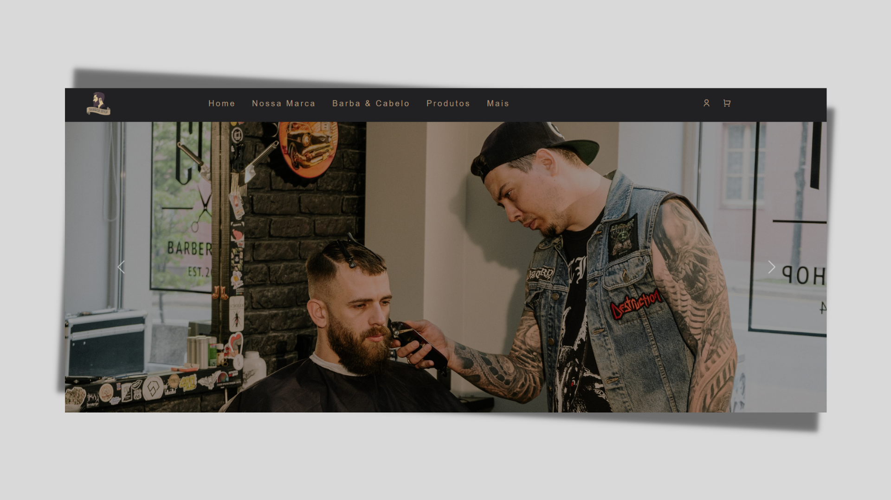

# website Barber Shop

## 📖 About  
**Website** Website creation as a form of exercise **HTML Web Developer** da **Conquer your spot**, using HTML,CSS e JavaScript.

---

## 🚀 Technologies and tools used

- [x] HTML
- [x] CSS
- [ ] JAVASCRIPT

---

## 🖥️ Demonstration

<<<<<<< HEAD

=======

>>>>>>> 38a81cbeb62a495e1d686232530001b72e4e4973

You can access the project by clicking [here](https://fe7rodrigues.github.io/barbershop-project/).
---

## 🔧 How to run the project

```bash
# clone the repository
git clone https://github.com/Fe7rodrigues/barbershop-project
# enter the directory
cd barbershop-project
```
After that, use a tool like [Live Server](https://marketplace.visualstudio.com/items?itemName=ritwickdey.LiveServer) to create a local server and run the project.

---

**Developed by [Fernando Rodrigues](https://github.com/Fe7rodrigues).**
